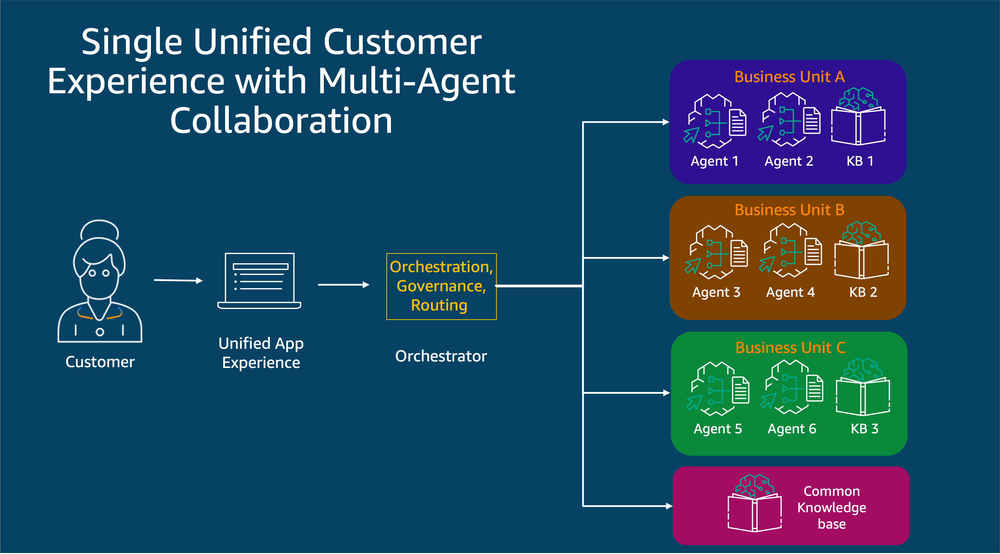

# Hierarchical Multi-Agent Collaboration with Agents for Amazon Bedrock Workshop

This hands-on workshop, aimed at developers and solution builders, introduces how to leverage multi-agent collaboration using [Agents for Amazon Bedrock](https://aws.amazon.com/bedrock/agents/).

To learn more about agents and advanced features please see the [Agents for Amazon Bedrock Workshop Repository](https://github.com/aws-samples/amazon-bedrock-samples/tree/main/agents-for-bedrock).

With the rise of generative AI powered applications that create powerful and innovative user experiences comes many new challenges. These challenges not only include traditional consideration of performance, latency, and cost but also the need to handle multi-faceted user queries and perform complicated tasks on behalf of the customer that rely on the interaction of multiple experts. This all while providing a unified experience for the user.

Consider the complex mortgage application process where multiple experts are needed to guide a customer through various stages. Traditionally, this would involve transferring the customer between different departments, Now, envision a system where these experts are part of a unified customer service chatbot interface that can assist the customer with various queries, perform research, take actions, seamlessly communicate with each other and provide results back to the user. This is the advantage of multi-agent collaboration (MAC).

This agentic paradigm facilitates the creation of a unified experience that can cover a single tone, enforce responsible AI through guardrails, and support conversations that depend on separate expert sub-agents with access to proprietary information through a knowledge base. This unified approach is essential for continuing to deliver innovative and ever increasingly complex Generative AI powered applications.

There are a several different MAC patterns such as the hierarchical and full-connected mesh model that have been implemented with more constantly emerging that address unique situations. Here we will focus on the hierarchical model. In this configuration, several sub-agents with their own LLM,tools,and prompt are managed by an orchestrator. This pattern can be made more complex by having multiple teams where each team is an instance of a central orchestrator overseeing multiple sub-agents. These teams are themselves then managed by an orchestrator.

In this workshop, we will leverage mult-agent-collaboration to build a mortgage chatbot. Participants will implement a simple hierarchical MAC model (1 orchestrator, 2 sub-agents) in three different ways: a supervisor agent coordinating specialized agents for different aspects of the mortgage application process, orchestration with an LLM using intent classification, and orchestration with function calling. The code demonstrates how to create effective prompts for each agent, implement orchestration logic, and manage communication between agents. Key concepts covered include specialized expertise, optimized prompts, modular development, and complex problem decomposition.

This repository contains the sample notebooks and resources associated with the MAC workshop. The workshop focuses on understanding and implementing multi-agent collaboration patterns using Large Language Models (LLMs). Through this workshop, participants will learn how to define clear roles for each agent, establish effective communication protocols and demonstrate how to evaluate the system. By the end of the workshop, attendees will have a solid understanding of how to leverage multi-agent collaboration to create more sophisticated and efficient AI-powered applications and leverage Amazon Bedrock to experiment further for their use cases.

## Contents
- **01 - Create mortgage subagents and knowledge base** \[Estimated time to complete - 20 mins\]
    - Create a Knowledge Base (KB) using [Knowledge Bases for Amazon Bedrock]
    - Create sample mortgage documents and upload them to the Knowledge Base
    - Create the agent for managing existing mortgages and supporting AWS Lambda function
    - Create the agent for handling new mortgage applications and supporting AWS Lambda function
    - Provide session context to the agents
    - Test and evaluate latency for a single agent
- **02 - Orchestration with Supervisor Agent** \[Estimated time to complete - 30 mins\]
    - Create at test supervisor agent
    - Create and apply Guardrails
    - Test and evaluate latency for orchestration with supervisor
- **03 - Orchestration with LLM intent classification** \[Estimated time to complete - 30 mins\]
    - Define intent classification prompt with reference to sub-agents
    - Test and Evaluate latency for intent classification orchestration
- **04 - Orchestration using Function Calling** \[Estimated time to complete - 30 mins\]
    - Define tools and its specifications
    - Test and evaluate latency for orchestration with function calling
    - Bedrock Titan Multimodal embeddings
- **05 - Agent Evaluation** \[Estimated time to complete - 10 mins\]
    - Using the agent evaluation framework for testing and validation

To start building, start your journey using one of the options below:

For [AWS led event start here](https://studio.us-east-1.prod.workshops.aws/preview/754f1bd0-0d77-4347-93ef-6b19e2603ec8/builds/b176f7aa-a853-4628-96ee-e698d8cf51fa/en-US/account-setup)

For [Customer environments start here ](https://studio.us-east-1.prod.workshops.aws/preview/754f1bd0-0d77-4347-93ef-6b19e2603ec8/builds/b176f7aa-a853-4628-96ee-e698d8cf51fa/en-US/getting-started)

You can also refer to these [Step-by-step guided instructions on the workshop website](https://studio.us-east-1.prod.workshops.aws/preview/754f1bd0-0d77-4347-93ef-6b19e2603ec8/builds/b176f7aa-a853-4628-96ee-e698d8cf51fa/en-US/introduction).

## Contributing
We welcome community contributions! Please ensure your sample aligns with AWS [best practices](https://aws.amazon.com/architecture/well-architected/), and please update the **Contents** section of this README file with a link to your sample, along with a description.

